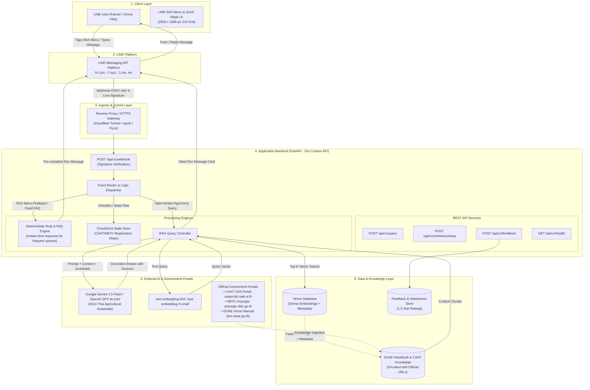

# AI LINE Chatbot for Agricultural Drone Knowledge Base
> **Course**: 2026 EN813701 Web Application Development  
> **Students**: 663040431-1 Surawit Nilket, 663040644-4 Kunasin Salabsri  
> **Topic**: AI Line Chatbot สำหรับ Knowledge Base โดรนเกษตร  

---

## 1. Project Overview & Motivation
Agricultural drones play an increasingly crucial role in precision agriculture in Thailand, particularly in rice paddy farming, cassava, sugarcane, and oil palm orchards. However, farmers and drone pilots encounter critical hurdles:
1. **Scattered Regulatory Information**: Strict Civil Aviation Authority of Thailand (CAAT / กพท.) and NBTC (กสทช.) laws, registration procedures, and third-party insurance rules are difficult to navigate.
2. **Precision Flight & Chemical Handling**: Lack of instant access to accurate flight parameters (altitude, speed, spray volume per rai) and safe chemical tank mixing sequences (WALES rule).
3. **Response Speed & Official Citations**: As gathered from drone pilot interviews, users need an expert available 24/7 with answers directly traceable to reliable Thai government bodies ([Department of Agricultural Extension (DOAE)](https://esc.doae.go.th/) and [CAAT UAS Portal](https://uasportal.caat.or.th/)).

This project implements a hybrid **Rule-Based + RAG (Retrieval-Augmented Generation) Chatbot** on **LINE**, connected via a **FastAPI** backend with a custom 6-tile Rich Menu.

---

## 2. System Architecture & Component Diagram



---

## 3. Specific API Integration Details

### 3.1 LINE Messaging API (LINE Corporation)
* **Base URL**: `https://api.line.me/v2/bot/`
* **Authentication**: `Authorization: Bearer {CHANNEL_ACCESS_TOKEN}`
* **Functions & Endpoints**:
  1. **Reply Message**:
     * **URL**: `POST https://api.line.me/v2/bot/message/reply`
     * **SDK Method**: `MessagingApi.reply_message(ReplyMessageRequest(...))`
     * **Usage**: Replies to user queries with Text or structured Flex Messages within the valid token window.
  2. **Loading Animation API (Chat Typing Indicator)**:
     * **URL**: `POST https://api.line.me/v2/bot/chat/loading/start`
     * **SDK Method**: `MessagingApi.show_loading_animation(ShowLoadingAnimationRequest(...))`
     * **Usage**: Displays animated typing bubbles while RAG searches documents and generates responses, fulfilling the 5–10 second latency user experience target.
  3. **Rich Menu Management**:
     * **URL**: `POST https://api.line.me/v2/bot/richmenu`
     * **SDK Method**: `MessagingApi.create_rich_menu(RichMenuRequest(...))`
     * **Image Upload URL**: `POST https://api-data.line.me/v2/bot/richmenu/{richMenuId}/content`
     * **Set Default URL**: `POST https://api.line.me/v2/bot/user/all/richmenu/{richMenuId}`

### 3.2 LLM & Embedding API (Google GenAI / Gemini)
* **Base URL**: `https://generativelanguage.googleapis.com/v1beta/`
* **Embedding Model**: `models/text-embedding-004`
  * **Function**: `client.models.embed_content(model="models/text-embedding-004", contents=query)`
  * **Usage**: Converts domain chunks and queries into 768-dimensional dense vectors.
* **LLM Model**: `models/gemini-1.5-flash`
  * **Function**: `client.models.generate_content(model="gemini-1.5-flash", contents=prompt)`
  * **System Guardrail**: Restricts answers strictly to Thai agricultural drone context with verified source attributions.

### 3.3 Custom Backend REST API (FastAPI)
* **Base URL**: `http://localhost:8000` (or public tunnel `https://<subdomain>.ngrok-free.app`)
* **Endpoints**:
  * `POST /api/v1/webhook`: Receives LINE webhook payloads and verifies cryptographic signatures (`X-Line-Signature`).
  * `POST /api/v1/query`: Direct query endpoint for automated testing, latency evaluation, and external web integration.
  * `GET /api/v1/richmenu/config`: Returns the active 6-button Rich Menu configuration JSON.
  * `POST /api/v1/richmenu/setup`: Programmatically generates the graphic, uploads it to LINE, and sets it as the default menu.
  * `POST /api/v1/feedback`: Records 1–5 star user satisfaction scores (satisfying Proposal Metric #3).
  * `GET /api/v1/feedback/stats`: Aggregates feedback metrics and satisfaction distribution.
  * `GET /api/v1/health`: Liveness and dependency status probe.

### 3.4 Official Reference Portals
* **CAAT UAS Portal**: [https://uasportal.caat.or.th/](https://uasportal.caat.or.th/)
* **CAAT Regulations Infographic**: [https://uasportal.caat.or.th/infographic](https://uasportal.caat.or.th/infographic)
* **NBTC Anyregis**: [https://anyregis.nbtc.go.th/](https://anyregis.nbtc.go.th/)
* **DOAE Agricultural Drone Handbook**: [https://esc.doae.go.th/.../โดรนเพื่อการเกษตร.pdf](https://esc.doae.go.th/wp-content/uploads/2024/05/%E0%B9%82%E0%B8%94%E0%B8%A3%E0%B8%99%E0%B9%80%E0%B8%9E%E0%B8%B7%E0%B9%88%E0%B8%AD%E0%B8%81%E0%B8%B2%E0%B8%A3%E0%B9%80%E0%B8%81%E0%B8%A9%E0%B8%95%E0%B8%A3.pdf)

---

## 4. LINE Rich Menu Design (Frequently Requested Information)

The Rich Menu is structured into a 2-row × 3-column grid (2500 × 1686 px) addressing the four primary topics highlighted by the instructor:

```
+-------------------------------------------------------------------------+
|                                                                         |
|   [ 1. กฎหมายโดรน ]         [ 2. ขึ้นทะเบียน CAAT/กสทช. ]   [ 3. เทคนิคฉีดพ่นข้าว ]  |
|   (Drone Laws & CAAT)       (Registration Steps)         (Rice Spraying Guide)  |
|                                                                         |
+-------------------------------------------------------------------------+
|                                                                         |
|   [ 4. ผสมสารเคมีปลอดภัย ]   [ 5. การบำรุงรักษาโดรน ]       [ 6. ถาม AI ผู้เชี่ยวชาญ ] |
|   (WALES Mixing & Safety)   (Maintenance & Care)         (Ask Freeform AI)      |
|                                                                         |
+-------------------------------------------------------------------------+
```

### Action Mappings:
1. **กฎหมายโดรน (Drone Laws)**: Returns Flex card summarizing max altitude (<90m), 30-50m buffer from people, daytime flight restriction, and direct link to the CAAT Infographic.
2. **ขึ้นทะเบียนโดรน (Registration)**: 3-step checklist (1. Insurance $\ge$ 1M THB $\rightarrow$ 2. NBTC Anyregis within 30 days $\rightarrow$ 3. CAAT UAS Portal).
3. **เทคนิคพ่นข้าว (Rice Spraying)**: Operational parameters: flight height 2.5–3.0m, flight speed 4.0–5.0 m/s, spray volume 15–20 L/ha (2.5–3.5 L/rai).
4. **ผสมสารเคมีปลอดภัย (Chemical Mixing)**: Tank mixing order (WALES rule: WP $\rightarrow$ WDG $\rightarrow$ SC $\rightarrow$ SL $\rightarrow$ EC $\rightarrow$ Surfactant) and PPE requirements.
5. **การบำรุงรักษา (Maintenance)**: Nozzle cleaning procedures (no metal wires), LiPo battery storage voltage (3.80–3.85V/cell), and compass calibration advice.
6. **ถาม AI (Ask AI)**: Prompts user to ask any complex or custom agricultural drone question.

---

## 5. Project Directory Structure

```
WebApp Project/
├── app/
│   ├── __init__.py
│   ├── main.py                  # FastAPI application entry point
│   ├── config.py                # Environment configuration and official URLs
│   ├── api/
│   │   ├── __init__.py
│   │   └── v1/
│   │       ├── __init__.py      # Router aggregator (/api/v1)
│   │       ├── webhook.py       # LINE Webhook receiver & signature verification
│   │       ├── query.py         # Direct REST query endpoint (testing/benchmark)
│   │       ├── richmenu.py      # Rich Menu setup and inspection endpoint
│   │       └── feedback.py      # User satisfaction rating endpoint (1-5 stars)
│   ├── core/
│   │   ├── __init__.py
│   │   ├── line_client.py       # LINE SDK v3 client (Reply, Loading, RichMenu)
│   │   └── dispatcher.py        # Hybrid Router: Rule Engine vs RAG Controller
│   ├── services/
│   │   ├── __init__.py
│   │   ├── knowledge_data.py    # Structured DOAE/CAAT knowledge dataset
│   │   ├── vector_store.py      # Vector store & semantic retrieval engine
│   │   ├── rule_engine.py       # High-frequency deterministic FAQ handlers
│   │   └── rag_service.py       # RAG generation with official citations
│   ├── models/
│   │   ├── __init__.py
│   │   └── schemas.py           # Pydantic request/response schemas
│   └── templates/
│       ├── __init__.py
│       ├── flex_messages.py     # LINE Flex Message card builders
│       └── rich_menu_config.py  # 2x3 Rich Menu configuration dictionary
├── data/
│   └── rich_menu.png            # Generated 2500x1686 PNG menu graphic
├── scripts/
│   ├── generate_menu_image.py   # Script to generate rich menu image
│   └── setup_rich_menu.py       # CLI script to upload and set default menu
├── tests/
│   ├── __init__.py
│   └── test_api.py              # Automated pytest suite (9 tests)
├── .env.example                 # Environment variables template
├── requirements.txt             # Python dependencies
└── README.md                    # Project documentation
```

---

## 6. How to Run and Test

### 6.1 Install Dependencies
```bash
pip install -r requirements.txt
```

### 6.2 Configure Environment Variables
Copy `.env.example` to `.env` and fill in your keys:
```bash
cp .env.example .env
```
* `LINE_CHANNEL_SECRET`: From LINE Developers Console.
* `LINE_CHANNEL_ACCESS_TOKEN`: From LINE Developers Console.
* `GEMINI_API_KEY`: From Google AI Studio (optional for offline testing; fallback semantic search works automatically).

### 6.3 Run Automated Tests
```bash
python -m pytest tests/test_api.py -v
```

### 6.4 Generate Rich Menu Image
```bash
python scripts/generate_menu_image.py
```
*(Produces `data/rich_menu.png` with 2500 × 1686 px dimensions).*

### 6.5 Start FastAPI Development Server
```bash
python -m uvicorn app.main:app --host 0.0.0.0 --port 8000 --reload
```
Access interactive Swagger UI documentation at: [http://localhost:8000/docs](http://localhost:8000/docs)

### 6.6 Connect to LINE Messaging API (Public Webhook)
1. Expose port 8000 using ngrok or Cloudflare Tunnel:
   ```bash
   ngrok http 8000
   ```
2. In the LINE Developers Console:
   * Set **Webhook URL** to: `https://<your-subdomain>.ngrok-free.app/api/v1/webhook`
   * Enable **Use webhook**.
   * Turn off **Auto-reply messages** in LINE Official Account Manager.
3. Deploy the Rich Menu to all followers:
   ```bash
   python scripts/setup_rich_menu.py
   ```
